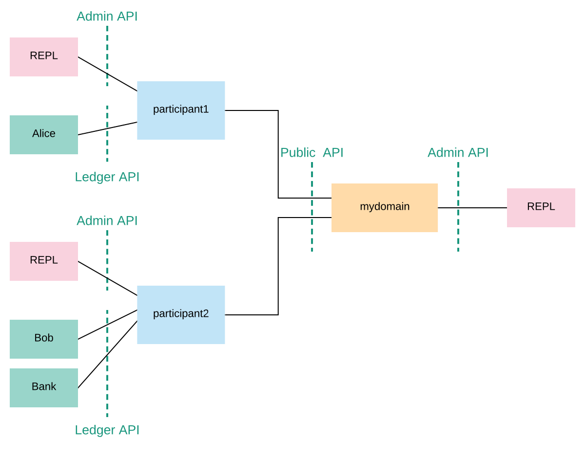

To understand the basic elements of Canton, let’s briefly look at the configuration that you started the console with. It is written in the [HOCON](https://github.com/lightbend/config/blob/master/HOCON.md) format and it is shown below. It specifies that you wish to run two participant nodes, whose local aliases are `participant1` and `participant2`, and a single synchronization domain, with the local alias `mydomain`. It also specifies the storage backend that each node should use (in this tutorial we’re using in-memory storage), and the network ports for various services, which we will describe shortly.

```
canton {
  participants {
    participant1 {
      storage.type = memory
      admin-api.port = 5012
      ledger-api.port = 5011
    }
    participant2 {
      storage.type = memory
      admin-api.port = 5022
      ledger-api.port = 5021
    }
  }
  domains {
    mydomain {
      storage.type = memory
      public-api.port = 5018
      admin-api.port = 5019
    }
  }
  // enable ledger_api commands for our getting started guide
  features.enable-testing-commands = yes
}
````

A participant node provides access to the global virtual Canton ledger to one or more Canton users, called **parties**. Under the hood, the participants synchronize the state of their parties’ contracts by running the Canton synchronization protocol. To run the protocol, the participants must connect to one or more synchronization domains, or just domains for short. In order to execute a **transaction*3 (a change that updates the shared contracts of several parties), there must exist a single domain to which all the parties’ participants are connected. In the remainder of this tutorial, you will construct the following network topology, that will enable the three parties Alice, Bob, and Bank to transact with each other.



The participant nodes provide their parties with a **Ledger API** as a mean to access the ledger. The parties can interact with the Ledger API manually using the console, but will in practice use applications to handle the interactions for them and display the data in a user-friendly interface.

In addition to the Ledger API, each participant node also exposes an **Admin API**. The Admin API allows the administrator (that is, you!) to:

1. manage the participant’s connections to domains,
2. add or remove parties to be hosted at the participant,
3. upload new Daml archives,
4. configure the operational data of the participant, such as cryptographic keys, and
5. run diagnostic commands.

The domain node exposes a **Public API** that is used by participant nodes to communicate with the synchronization domain. This must be accessible from where the participant nodes are hosted.

Similar to the participant node, a domain also exposes an Admin API for administration services. You can use these to manage keys, domain parameters and enable or disable participants within a domain, for example. The console provides access to the Admin APIs of the configured participants and domains.

> Note: Canton’s Admin APIs must not be confused with the `admin` package of the Ledger API. The `admin` package of the Ledger API provides services for managing parties and packages on any Daml participant. Canton’s Admin APIs allows you to administrate Canton-based nodes. Both, the participant and the domain nodes expose an Admin API with partially overlapping functionality.

Furthermore, participants and domains communicate with each other through the Public API. The participants do not communicate with each other directly, but are free to connect to as many domains as they desire.

As you can see, nothing in the configuration specifies that our `participant1` and `participant2` should connect to `mydomain`. Canton connections are not statically configured – they are added dynamically instead. In fact, when you started the console, even the nodes are not started automatically, as you can also use the console to attach to nodes running in daemon mode. So first, let’s connect the participants to the domain.
