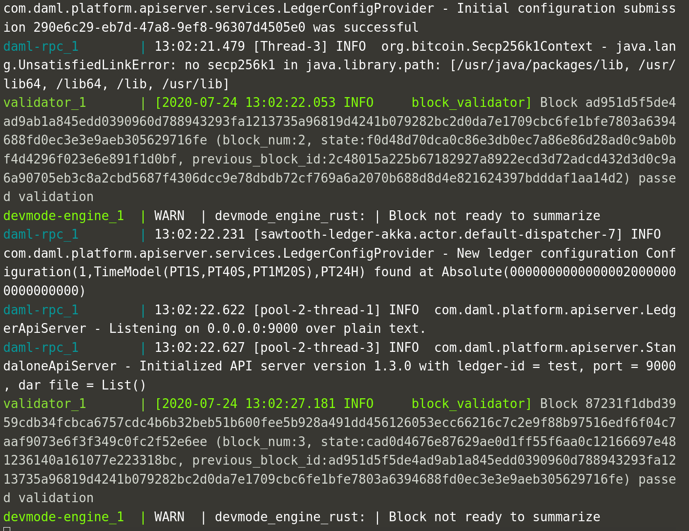

Once you've written your DAML application, wrote a cool UI for it and tested everything against the
sandbox ledger, it's time to deploy to a real ledger. This Katacoda runs you through the steps to
deploy your application on the [Hyperledger Sawtooth](https://sawtooth.hyperledger.org) distributed
ledger. We'll be using the excellent integration provided by
[BlockchainTP](https://github.com/blockchaintp/daml-on-sawtooth)

