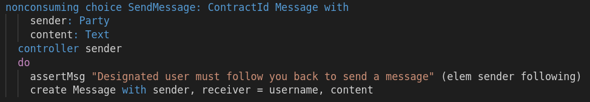

Your DAML model is the core of your application. It defines three things

1. The representation of your application data
1. The access rights to your application data
1. The API to interact with your application

**With DAML you first think thoroughly about your data model.** Once the DAML model is established,
the DAML ecosystem will take as much work as possible of you. It will take care of how that data
will get stored on your chosen back-end ledger, it will expose a gRPC and JSON API and generate
client side and UI libraries to connect to it, all without you writing a single line of code.

In the [DAML Template
Authorization](https://daml.com/learn/fundamental-concepts/template-authorization/) tutorial we
discussed how to setup access rights to your application data. In this tutorial you'll learn how to
design your exposed API to interact with your application with [DAML
choices](https://docs.daml.com/daml/reference/choices.html).

