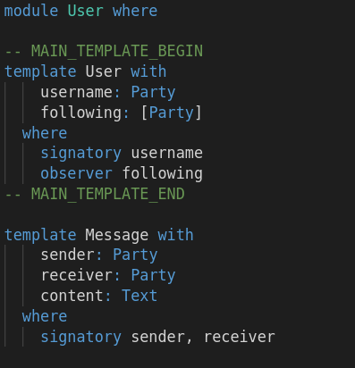

Let's start with the data model of the create-daml-app, but with all choices removed. In the
terminal, you see the sandbox ledger booting up, we'll be using it in the next step. Open the IDE
tab and open the `daml/User.daml`{{open}} file. We're left with plain contract data templates:



Now let's think about the API we want our application to have. We want to expose endpoints with the
following semantics:

- `createUser`: anyone can create a new `User` to setup an account
- `sendMessage`: an existing `User` can receive a `Message` given the sender and its content.

Let us use the following notation to describe these endpoints:

```
createUser: User -> Update (Existing User)

sendMessage: Existing User -> Party -> Text -> Update (Existing Message)
```

The right side of these API signatures is what we want them to return, while the left side of the
arrows (->) are the inputs that are required. The `Update` means that a computation will take place
to compute the enclosed value that will potentially need to change the state of the ledger.

In the next step you'll learn to go from abstract API idea to a concrete implementation through Daml
choices.
