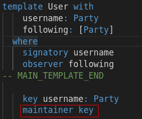

We've seen that contract keys need to be unique and an attempt to create two contracts with the same
key results in a runtime error. While uniqueness of a contact key is rather easily checked on a
centralized ledger, it is an inherently hard property to enforce in a distributed setting. This is
why for every contract key you also need to specify who is maintaining that key. You do this with
the `maintainer` keyword:



The set of maintaining parties is responsible to enforce the uniqueness of that contract key. The
maintaining parties always need to be a subset of the signatories of the contract and need to be a
part of the key itself. After the `maintainer` keyword you specify a projection function of type
`key -> Party` or `key -> [Party]`. So for example, if you would choose your key to be

```
key (username, following) : (Party, [Party])
```

a possible maintainer function could be

```
maintainer _1
```

or also

```
maintainer _2
```

Here the functions `_1: (a, b) -> a` and `_2: (a, b) -> b` are the projections onto the first or
second factor of a tuple. 

In the case of our `User` contract it is sensitive to assume that the `username` is a unique field
among all `User` contracts. Knowing that every party sees the creation of a contract with the
`username` field set to its name, we make it the responsibility of such a party to ensure and check
that only one such contract exists at any given time.
