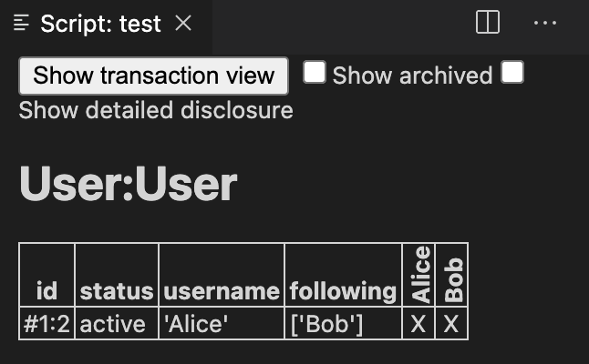

All Daml update actions that work on contract IDs also have a counter part for contract keys:

| Contract ID | Contract Key  |
|-------------|---------------|
| exercise    | exerciseByKey |
| fetch       | fetchByKey    |
| lookup      | lookupByKey   |

The above Daml update actions are repreresented by four actions in Daml Script, where `fetch` and `lookup` actions are folded into `queryContract` actions.

 
<table>
  <tr>
    <td>Daml</td>
    <td colspan=2 style="text-align: center;">Daml Script</td>
  </tr>
  <tr>
    <td></td>
    <td>Contract ID</td>
    <td>Contract Key</td>
  </tr>
    <tr>
    <td>exercise</td>
    <td>exercsieCmd</td>
    <td>exerciseByKeyCmd</td>
  </tr>
    <tr>
    <td>fetch/lookup</td>
    <td>queryContractId</td>
    <td>queryContractKey</td>
  </tr>
</table>
 

Let's try these out with a Daml script. First, we let `Alice` exercise the `Follow` choice with
`exerciseByKeyCmd`:

<pre class="file" data-filename="daml/User.daml" data-target="append">
test = script do
  alice <- allocateParty "Alice"
  bob <- allocateParty "Bob"
  submit alice $ createCmd User with username=alice, following=[]
  aliceContractId <- submit alice $ exerciseByKeyCmd @User alice $ Follow bob
  return()
</pre>

- `exerciseByKeyCmd` maps to `exerciseCmd` in Daml and takes as a first argument the template name of the contract we want to exercise a
  choice on preceded by an `@`
- the second argument is the contract key, in this case `alice`

You can see that `Alice` is now following in the script output when you click on `script results`:

We can also check this by fetching the contract with `fetchByKey` in Daml. For illustrative purpose we will use `queryContractKey` to show how this done in Daml Script. Before appending the code please delete the `return()` statement.

<pre class="file" data-filename="daml/User.daml" data-target="append">

  userContractIdAndContract <- queryContractKey @User alice (alice)
  -- We get back an Optional Tuple, like in Haskell we can
  -- first use fromSome to unpack the Optional Tuple when it is Some Tuple
  -- then we access the first and second elements with helper functions (fst, snd),
  -- or alternatively access them positionally with t._1, t._2 and so on

  let contractId = fst $ fromSome userContractIdAndContract
  let contract = snd $ fromSome userContractIdAndContract
  assert $ contract == User with username=alice, following=[bob]
  assert $ aliceContractId == contractId
  return()
</pre>

- `queryContractKey` takes as first argument the `template` name (`@User`), the `Party` that will make the query as the second argument (`alice`), and the contract key as the third argument (`(alice)`)
- `fetchByKey` takes only two argument, i.e., the template name and the contract key
- Both actions return a tuple, where the first factor is the actual contract ID and the second factor is the
  contract data

Since we didn't exercise a choice on `Alice` `User` contract, we expect the returned contract ID
to be unchanged. We check if this is true with `assert $ aliceContractId == contractId`.

As Daml Script offers only `queryContractKey` for both `fetchByKey` and `lookupByKey` we will explain the similarities and differences between the two:

- `lookupByKey` takes the same two arguments as `fetchByKey`, i.e., the template name and the contract key
- `lookupByKey` is similar to `fetchByKey`, but instead of failing the transaction, it will return a
`None` if the given key does not exist.
- `lookupByKey` does not give any information of whether a contract with a given key exists or not.
If it returns `None`, that means either there is no active contract with that key or the submitting
party is simply not observing it.
- Finally, `lookupByKey` is slightly different from it's `lookup` counterpart, in that it needs to be
authorized by all key maintainers.
