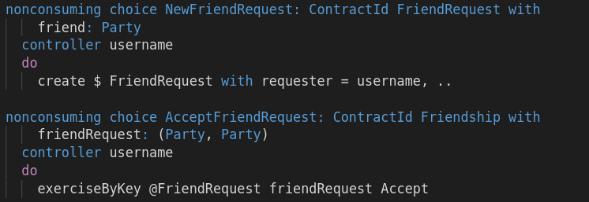
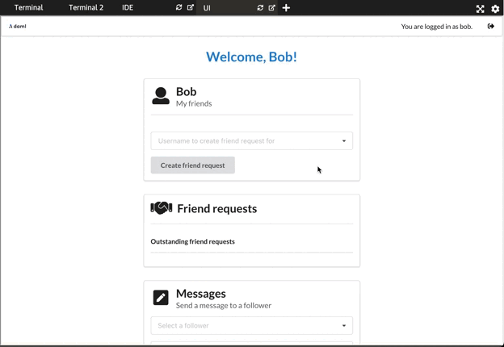

In [Choices and the Role Pattern](https://daml.com/learn/fundamental-concepts/choices-role-pattern)
you learned about the Role Pattern to group non-consuming choices and define user roles with clearly
specified capabilities.

In this scenario, we take a look at the [Propose/Accept
pattern](https://en.wikipedia.org/wiki/Offer_and_acceptance). The **Propose/Accept** pattern is the
best way to create contracts with multiple signatories. It is also an elegant way to delegate rights
to a party by creating a role contract for it. In that way, the Propose/Accept pattern complements
the Role pattern.

It's not surprising that the Propose/Accept pattern turns out to be helpful in DAML. DAML's
authority rules are guided by actual legal contracts, and the Propose/Accept pattern is a well known
and tested pattern in [contract law](https://en.wikipedia.org/wiki/Offer_and_acceptance).

