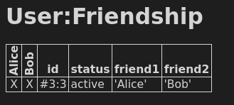
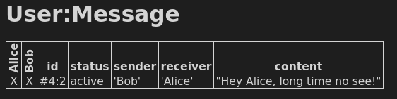

Let's test our new model with a Daml script. First, let's create two users:

<pre class="file" data-filename="daml/User.daml" data-target="append">

test = script do
  alice <- allocateParty "Alice"
  bob <- allocateParty "Bob"
  submit alice $ createCmd $ User with username=alice
  submit bob $ createCmd $ User with username=bob
</pre>

Now `Alice` can create a `FriendRequest` with her `User` role contract:

<pre class="file" data-filename="daml/User.daml" data-target="append">
  submit alice $ exerciseByKeyCmd @User alice $ NewFriendRequest with friend=bob
</pre>

`Bob` accepts it

<pre class="file" data-filename="daml/User.daml" data-target="append">
  submit bob $ exerciseByKeyCmd @FriendRequest (alice, bob) Accept
  return ()
</pre>

and you can see in the script results that a new `Friendship` has been created between `Alice`
and `Bob`

Because a `Friendship` contract has been established between the two parties, they can now start
sending messages to each other. Replace the last line of the script with:

<pre class="file" data-target="clipboard">
  submit bob $ exerciseByKeyCmd @Friendship (alice, bob) $ SendMessage2 with content="Hey Alice, long time no see!"
</pre>

Notice, how `Bob` uses the `SendMessage2` choice because he is in the 'friend2' field of the
`Friendship` contract.

You can see in the script results that `Alice` indeed receives this message:

