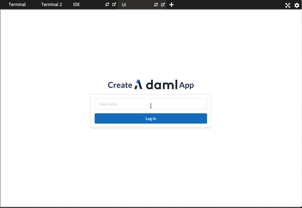

You can now [open the UI
tab](https://[[HOST_SUBDOMAIN]]-3000-[[KATACODA_HOST]].environments.katacoda.com). Note that it
might take a few moments for the UI to launch. You are presented with the `create-daml-app` login
screen.The following screencast shows off the new `FriendRequest` functionality:

The workflow is like this:
1. First `Alice` needs to log in and out to register herself on the network. Remeber that **usernames are case sensitive and are lower*** so to log in as `Alice` type in her username `aluce`
2. Log in as `Bob`. As `Alice` has previously logged in and registerd herself on the network `Bob` can send her a friend request.
3. Log out from `Bob`'s account and log in as `Alice` again
4. `Alice` will see a new friend request that she can accept

In addition `Alice` can now send messages to `Bob` and vice-versa.
