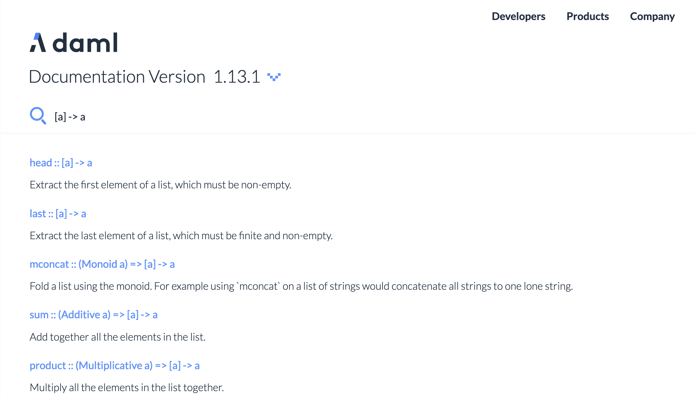

Daml's standard library and Prelude module provides you with all the essential data containers like
lists, sets and maps together with efficient algorithms to work with them.

This scenario is a small tour through the standard library pointing out just the highlights!

