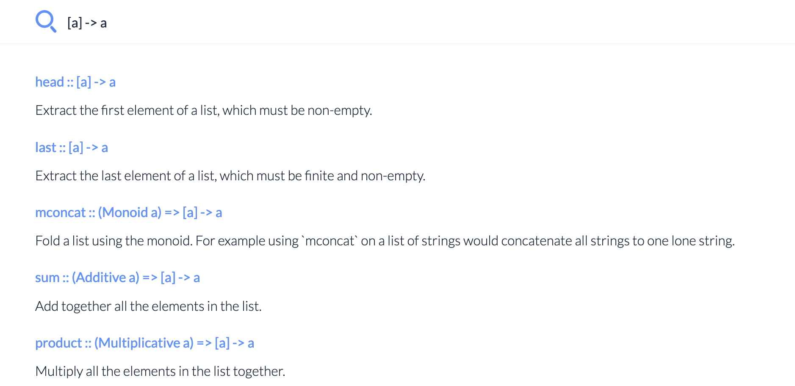

# List

The **list** is one of the most fundamental container types in Daml. The list type is defined with
square brackets. Open the IDE tab and wait for it to load. Then have a look the
`daml/AddressBook.daml`{{open}} module of the previous [data type
course](https://www.katacoda.com/daml/courses/fundamental-concepts/data-types-imports). Let's allow
a person to have multiple addresses:

<pre class=file data-filename="daml/AddressBook.daml" data-target="append">

data Address = Address {
  street: Text,
  city: Text,
  country: Text
} deriving (Eq, Show)

data Person = Person {
  name: Text,
  addresses: [Address],
  age: Int
}
</pre>

An example `Person` data structure will then look like this:

<pre class=file data-filename="daml/AddressBook.daml" data-target="append">
testPerson: Person
testPerson = Person {name = "Alice", addresses = [Address {street = "RabbitStreet", city = "QueenOfHearts", country = "Wonderland"}], age = 7}
</pre>

Notice, how we constructed a list with a single element by enclosing it in square brackets `[]` for
the addresses field.

The `DA.List` module and the `Prelude` (which is always imported) contains many important
algorithms to work with lists. Here are just a few of the most common and important:

- (++): [a] -> [a] -> [a]
  Concatenate two lists.
- (::): a -> [a] -> [a]
  Add an element to the beginning of a list.
- sort: Ord a => [a] -> [a]
  Stable sorting of lists with elements that can be compared.
  `sort [3, 2, 1] -- [1, 2, 3]`
- dedup: Ord a => [a] -> [a]
  Removes duplicates from a list.
  `dedup [3, 3, 2, 1]` -- [3, 2, 1]`
- takeWhile: (a -> Bool) -> [a] -> [a]
  Take all elements from the beginning of a list as long as the given predicate is satisfied.
  `takeWhile (> 3) [5, 4, 3, 2, 1] -- [5, 4]`
- head: [a] -> a
  Take the first element from a list. Be sure to assert that the list isn't empty, otherwise you'll
  get a runtime error.
  `head [1, 2, 3] -- 1`
- last: [a] -> a
  Extract the last element from a list. Again, make sure that the list is not empty.
  `last [1, 2, 3] -- 3`
- delete: a -> [a] -> a
  Delete the first occurence of the given element from a list if it is present.
  delete 1 [1, 2, 3] -- [2, 3]
- `(\\): Eq a => [a] -> [a] -> [a]`
  List difference.
  `[1, 2, 3, 4, 5, 6] \\ [1, 3, 5] -- [2, 4, 6]`
- foldl: (b -> a -> b) -> b -> [a] -> b
  `foldl f initialValue xs` is a left associative fold of the function `f` over a list `xs` updating
  an accumulator of type `b` starting with the `initialValue` and finally returning that accumulator.
  `foldl (\x y -> x + y) 0 [1, 2, 3] -- 6`

Be sure to check the documentation of [DA.List](https://docs.daml.com/daml/stdlib/DA-List.html) and
[Prelude](https://docs.daml.com/daml/stdlib/Prelude.html) before trying to implement your own list
algorithms, there's a fair chance it's already there!

Remember that you can also search the [docs](https://docs.daml.com) with queries for types. Say
you're looking for the `head` function but you can't remember its name, but only its type: `[a] -> a`.
Searching for `[a] -> a` will indeed give `head` as first result, followed by `last` and other
functions with the same or similar type.

>> 1) How would you search for the sort function? <<
() `a -> [a]`
(*) `[a] -> [a]`
() `a -> a`
() `[a] -> a`

**Scroll down to find the solutions for the quiz!**

 
 
 
 
 
 
 
 
 
 
 
 
 
 
 
 
 
 
 
 

### Solutions

1. `[a] -> [a]` Sorting takes a list and returns a sorted list.
