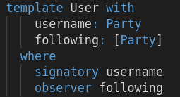
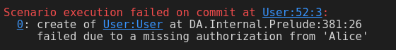
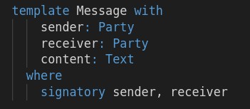

Daml's contracts are immutable. The only way to change the content of a contract is to `archive` it
and `create` a new one. Hence Daml's analogy to UNIX's `write` access is the right to `create` and
`archive` a contract. This right is given to a party by listing it after the `signatory` keyword.

As with `observers`, a signatory needs to be a field of the contract template. For example, in the
`User` contract, we want the party in the `username` field of the contract to be its signatory.

Contract signatories are automatically also contract observers.

Let's see what happens when a non-signatory party tries to create a contract for a different
signatory. Add the line

<pre class="file" data-filename="daml/User.daml" data-target="append">
  submit bob $ createCmd User with username = alice, following = []
</pre>

to the end of the script. As expected, the script fails and you get a missing authorization error:

Indeed, only `Alice` is able to create a `User` contract on which she is signatory.

Replace the last line with

<pre class="file" data-target="clipboard">
  submitMustFail bob $ createCmd User with username = alice, following = []
</pre>

and your script passes again.

Since every party on a Daml ledger is authenticated, and only the party that appears in the
signatory field of a contract can create it, we can regard such a contract as signed by the
signatory party.

But how can you create a contract with multiple signatories? For example the `Message` contract

For this, we first have to understand `controllers`.
