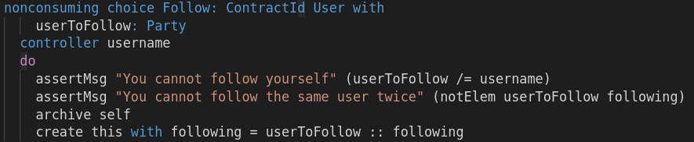
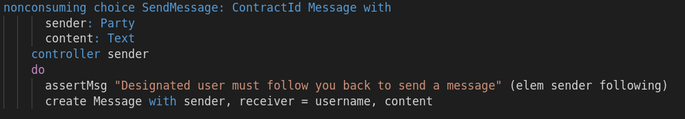

The third UNIX access right is the right to execute an executable file, denoted by **x** in the `ls`
output. While in UNIX the right to access is per file, in Daml the right to execute is more fine
grained and denoted per choice of a contract. A choice on a contract defines a possible transaction
on the ledger. You give a party the right to execute a choice and hence commit that transaction, by
making it the `controller` of that choice.

As in the case of `signatories` and `observers`, the `controller` can be a field of type `Party` of
the contract template containing the choice. Different from `signatories` and `observers`, it can
also be specified as a choice argument such as in the `SendMessage` choice:

Lets confirm that the in-memory ledger enforces `controllers`. Append the line

<pre class="file" data-filename="daml/User.daml" data-target="append">
  c1 <- submit bob $ create User with username = bob, following = []
  c2 <- submit bob $ exercise c1 $ Follow with userToFollow = alice
  return ()
</pre>

We create a new `User` contract for `Bob`. Then `Bob` exercises the `Follow` choice with `Alice` as
argument. This passes, because `Bob` controls the `Follow` choice of his `User` contract and hence
has the right to execute the choice.

Now replace the last line with

<pre class="file" data-target="clipboard">
  submit alice $ exercise c2 $ Follow with userToFollow = charlie
</pre>

to the scenario. You will get a scenario error:

As expected, because `Alice` isn't a controller of the `Follow` choice on `Bob`'s `User` contract
and she can't make him follow `Charlie`.

Change the last line to
<pre class="file" data-target="clipboard">
  submitMustFail alice $ exercise c2 $ Follow with userToFollow = alice
</pre>

to make the scenario work again.

In the final step of this Katacoda, you'll learn how to delegate authorization to execute choices
from one party to another and how this allows you to create contracts with multiple signatories.
