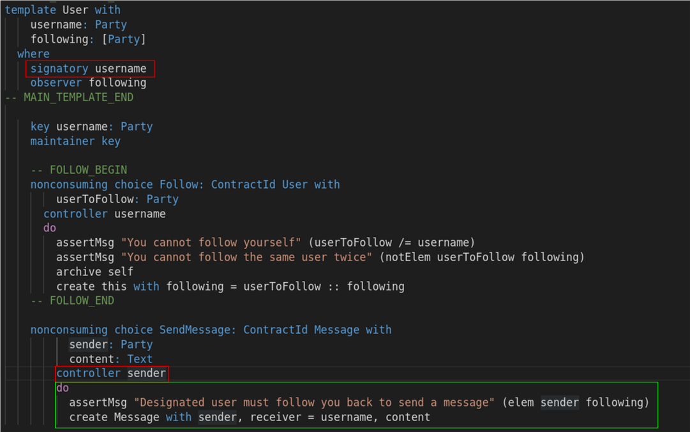
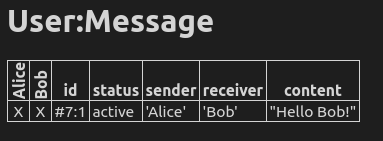

We've seen Daml's authority checks in a couple of situations now:

- You can only create or archive a contract if you are acting as the signatories of that contract.
- You can only fetch a contract, if you are listed as an observer (or signatory) of that contract.
- You can only exercise a choice on a contract, if you are acting as the controllers of that
  contract.

Every [Daml update](https://docs.daml.com/daml/reference/updates.html) action has an authority rule
that is enforced by the interpreter of a Daml ledger.

We've seen how to act as the single signatory or controller of a contract. But how can you act as
multiple signatories or controllers?

The trick is, that when you exercise a choice as a controller, you're not only just acting with the
authority of that controller, but you also gain the authority of the contract's signatories.

For example, when we you execute the `SendMessage` choice you don't execute the following update
with just your authority, but the signatory of the `User` contract **delegates** his authority to
you as well. Thus you are acting the update (in green) with the authority of the parties specified
in `sender` **and** `username` (in red). This is why you can create a `Message` contract that needs
two signatories, the `sender` and `receiver`.

Again, there is an analogy to the UNIX file system: In the UNIX file system you can set the `setuid`
flag of an executable. If its set, the user executing the file also gains the file owners authority.
In Daml the file owner corresponds to the `signatory` and executing a file corresponds to executing
a choice.

Finally, let's create a `Message` contract with two signatories. Add the following line to the
scenario:

<pre class="file" data-filename="daml/User.daml" data-target="append">
  submit alice $ exercise c2 $ SendMessage with sender = alice, content = "Hello Bob!"
</pre>

You'll see the new `Message` contract in the scenario results.

