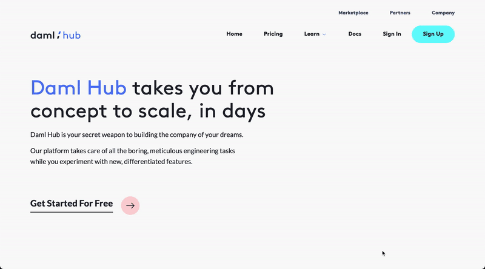
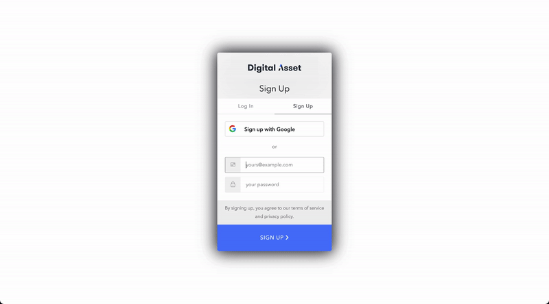

Now that we have our assets ready for deployment it is time to deploy them to Daml Hub!

This step guides you through signing up for a Daml Hub free account. If you have one already feel free to just log in and skip ahead.

Visit the [Daml Hub home page](https://hub.daml.com) and click on _"Get Started for Free!"_.
Then click on _"Sign Up for Free"_.

You can choose to sign up with your Google account or use your email and password.

Please note that you will have to verify your email prior to logging in, if you did not use your Google credentials:

Once you have signed up, let's move on to create the ledger that will host our app.
