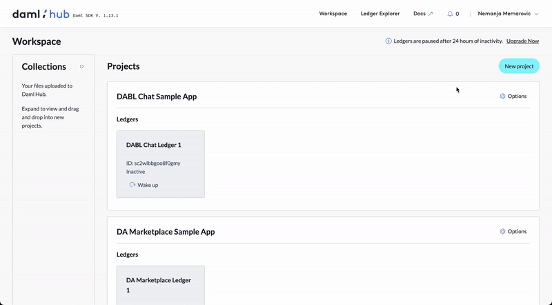
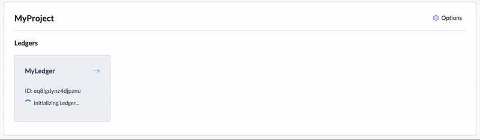

Once you log in to Daml Hub, it is time to create your first ledger.

Ledgers are dedicated infrastructure for your application that can host daml models, static web UI assets as well as automation and integrations with external APIs.

Ledgers live under projects, which are just logical groupings of ledgers.

To create your first project and ledger, navigate to the _Workspace_ and simply click on _"New Project"_ and choose a name for your project and ledger.

You should receive two confirmation messages and your new ledger will start initializing.

It may take a minute until your ledger is ready. Once initialized, the spinner will stop and the ledger tile will become active.

Now that your ledger is ready, let's move on to the next step to deploy your artifacts!
