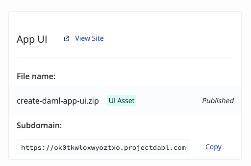

Time to upload your artifacts to your new ledger!

First download the artifacts you built in the previous steps:

- [Download create-daml-app.dar](https://[[HOST_SUBDOMAIN]]-8080-[[KATACODA_HOST]].environments.katacoda.com/create-daml-app.dar)

- [Download create-daml-app-ui.zip](https://[[HOST_SUBDOMAIN]]-8080-[[KATACODA_HOST]].environments.katacoda.com/create-daml-app-ui.zip)

Then click on your newly created ledger and under the _"Deployments"_ tab click on _"Upload File"_ and upload the `create-daml-app.dar` you just downloaded.

You should see two confirmation messages and your `.dar` file will appear as a deployed file.

For the last step you will need to upload your UI Assets.

Click again on _"Upload File"_ and select the `create-daml-app-ui.zip` you just downloaded.

You should get another set of confirmations and the top bar of _"Deployments"_ will update revealing the subdomain of your deployed app and a quick link to visit it:

Click on _"View Site"_ or copy paste the subdomain link to a new browser tab and start interacting with your deployed app!

## You completed the entire Getting Started Guide. Congrats! Share a screenshot of your accomplishment [on our forum](https://discuss.daml.com) to get your [final badge for completing this series](https://discuss.daml.com/badges/104/ascendant-lawnmower)!