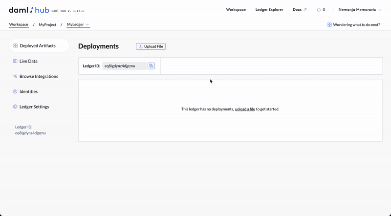
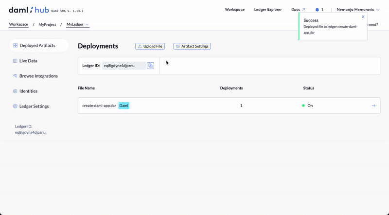
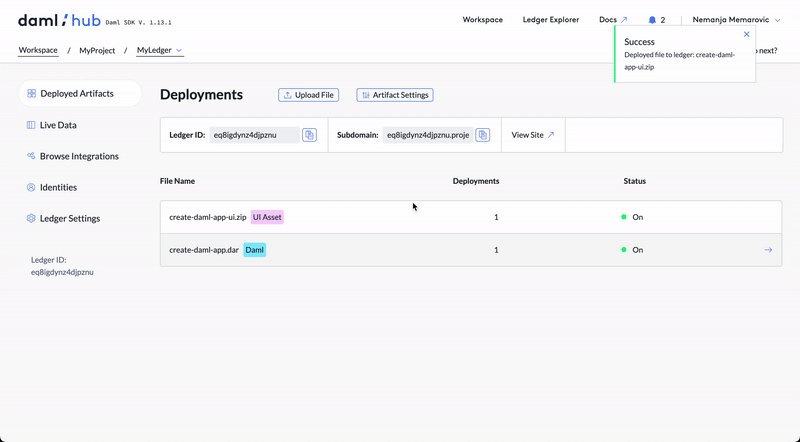

Time to upload your artifacts to your new ledger!

First download the artifacts you built in the previous steps:

- [Download create-daml-app.dar](https://[[HOST_SUBDOMAIN]]-8080-[[KATACODA_HOST]].environments.katacoda.com/create-daml-app.dar)

- [Download create-daml-app-ui.zip](https://[[HOST_SUBDOMAIN]]-8080-[[KATACODA_HOST]].environments.katacoda.com/create-daml-app-ui.zip)

Then click on your newly created ledger and under the _"Deployments"_ tab click on _"Upload File"_ and upload the `create-daml-app.dar` you just downloaded. You should see two confirmation messages. In order to deploy the `.dar` file to Daml Hub you need to click on the _"Deploy Instance"_ button and your `.dar` file will appear as a deployed file.

For the last step you will need to upload your UI Assets. Click again on the _"Upload File"_ button and select the `create-daml-app-ui.zip` you just downloaded. You should get another set of confirmations and again the option to deploy the newly added files. Clicking on the _"Deploy Instance"_ button will deploy the UI.

After deploying the UI the you will get the application's subdomain and a quick link to visit it:

Click on _"View Site"_ or copy paste the subdomain link to a new browser tab and start interacting with your deployed app!
