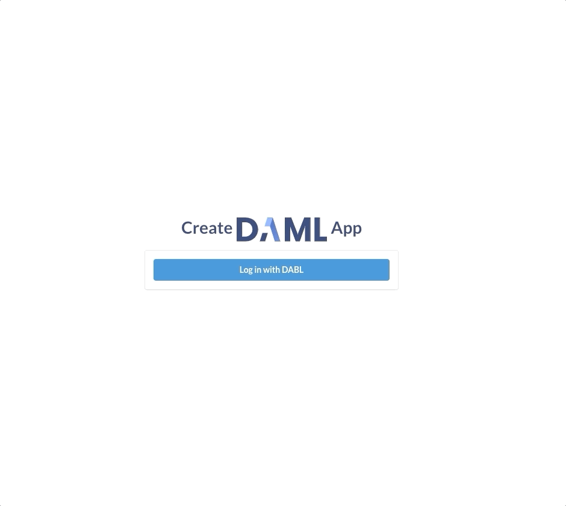

Well done, you have now deployed your app to project:DABL!

Hopefully this exercise gives you a sense of the power and ease of building and deploying Daml apps. Explore the [Daml documentation](https://docs.daml.com) and [project:DABL docs](https://docs.projectdabl.com) to learn more, and keep shipping Daml apps. Have fun!

As always, if you have any questions or problems, connect with the Daml Community on the [Daml
forum](https://discuss.daml.com).
