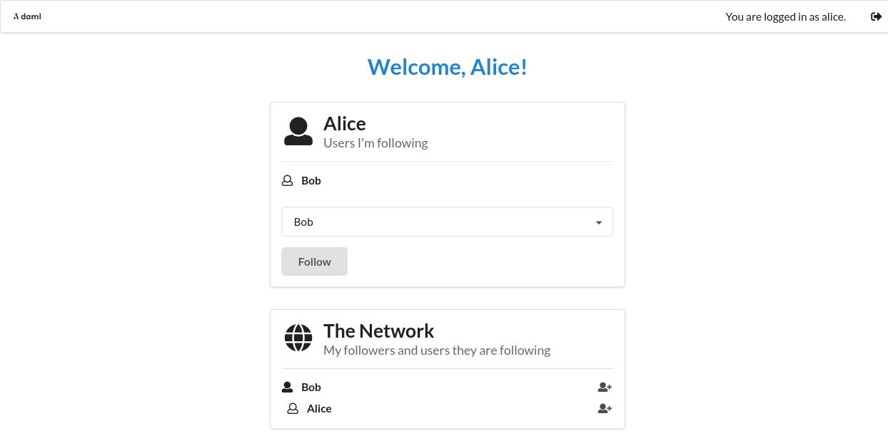

You can login as Bob using `participant2` by following essentially the same process as for `participant1`, just adjusting ports to correspond to `participant2`.

First, start another instance of the HTTP JSON API, this time using the options `-- ledger-port=12021` and `--http-port 7576`. `12021` corresponds to `participant2`’s ledger port, and `7576` is a new port for another instance of the HTTP JSON API.

```
DAML_SDK_VERSION=2.1.1 daml json-api \
   --ledger-host localhost \
   --ledger-port 12021 \
   --http-port 7576 \
   --allow-insecure-tokens
```{{execute T4}}

Then start another instance of the UI for Bob, running on port `3001` and connected to the HTTP JSON API on port `7576`.

```
cd canton-open-source-2.1.1/create-daml-app/ui
PORT=3001 REACT_APP_HTTP_JSON=http://localhost:7576 REACT_APP_LEDGER_ID=participant2 npm start
```{{execute T5}}

You can then login using the user id `bob`.

Now that both parties have logged in, you can select `Bob` in the dropdown from `Alice`’s view and follow him and the other way around.

After both parties have followed each other, the resulting view from `Alice`’s side will look as follows.


