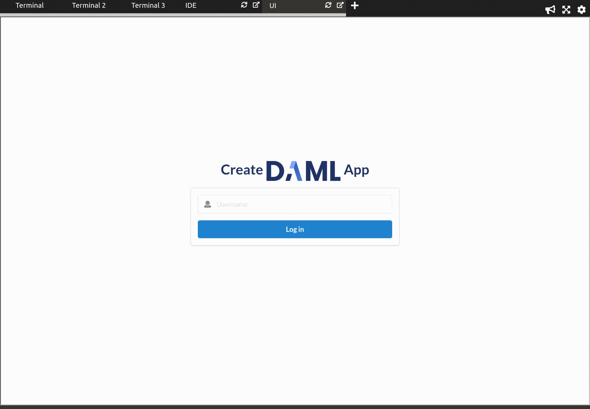

When you write a DAML application, the best way two parties can communicate to coordinate a workflow
is via the underlying ledger. 

For instance, imagine a workflow where a wine vendor sends out an invoice for a fine bottle of
Bordeaux to one of his clients. Once she receives payment from her client, she will send her a
receipt. The creation of the receipt signals to the client, that the payment was received and she
can archive the invoice.

If that client buys wine often, it would be cumbersome for her to manually check for the existence
of new receipts and archive the corresponding invoices over and over. This is where DAML triggers
come in. DAML triggers let you define a trigger that periodically checks for new receipts and
archives all corresponding invoices. This will also make sure that in a UI for this model no old
invoices will linger around.

Database triggers have been around for a long time in centralized databases like PostgreSQL. DAML
triggers are their equivalent for the distributed ledger age. Because you can define triggers within
your DAML code, it becomes easy to express fairly complicated automation logic without the need for
an external application.

You can find the full documentation for DAML triggers
[here](https://docs.daml.com/triggers/index.html).

