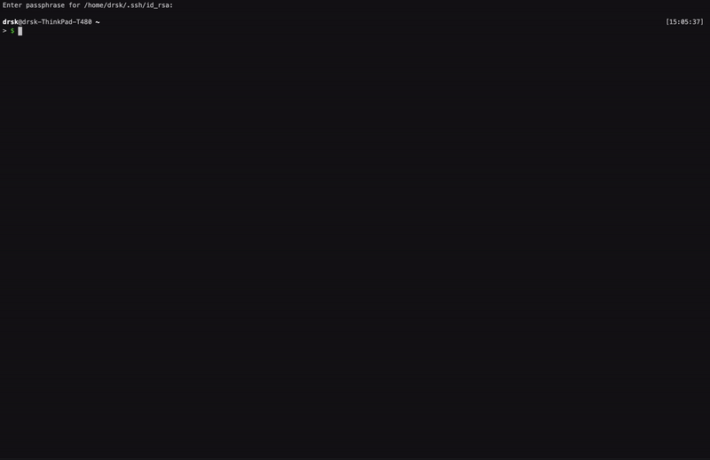

Database schemas tend to evolve over time. Your business might change, the data that you collect
might need to be extended or your access rights might need updating. For example, you might decide
to interact with a new partner and share your database, but the access rights need to be different
from what you have deployed for your other partners. Or maybe you decide to share parts of your data
of a running ledger with the public for reading but not writing.

In this first article on Daml application upgrades you learn how to extend your Daml model and ship this
extension as a Daml package to a running application. This package will depend on the already deployed
Daml packages running on the ledger. As a running example, we will extend the social network you build in
the [Getting Started Guide](https://daml.com/interactive-tutorials/getting-started/) with a forum.

In the follow up article on Daml upgrades, you will learn how to make changes to an already deployed
Daml package and how to migrate the data to your new model.

You can find more documentation on upgrading Daml models and applications
[here](https://docs.daml.com/upgrade/index.html).

