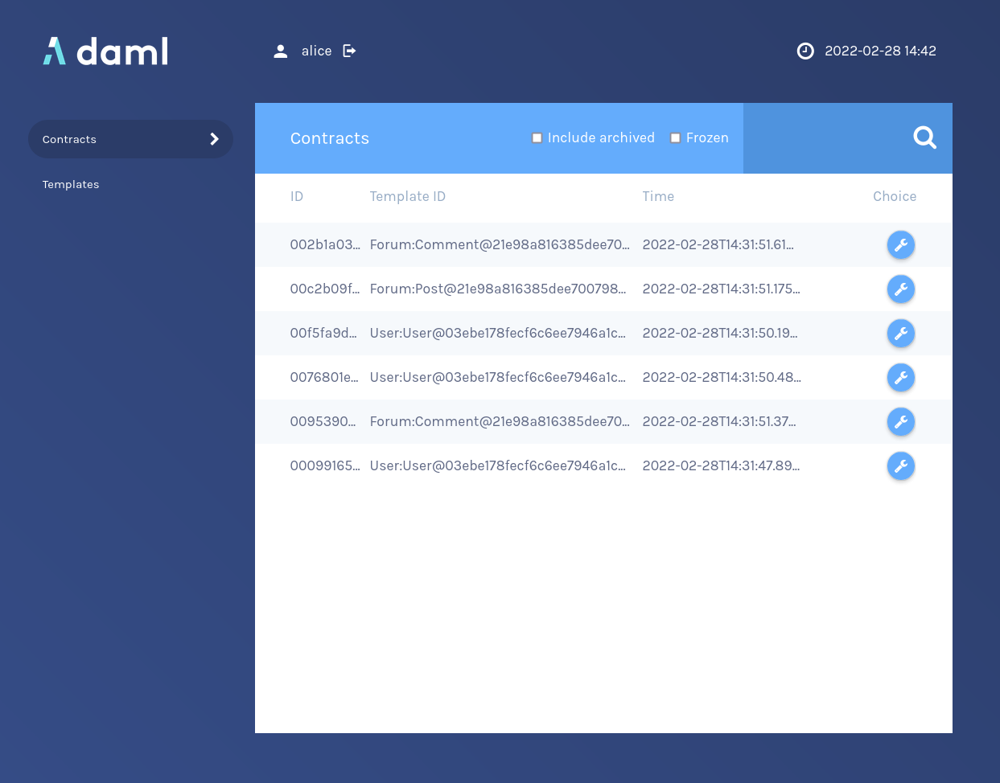
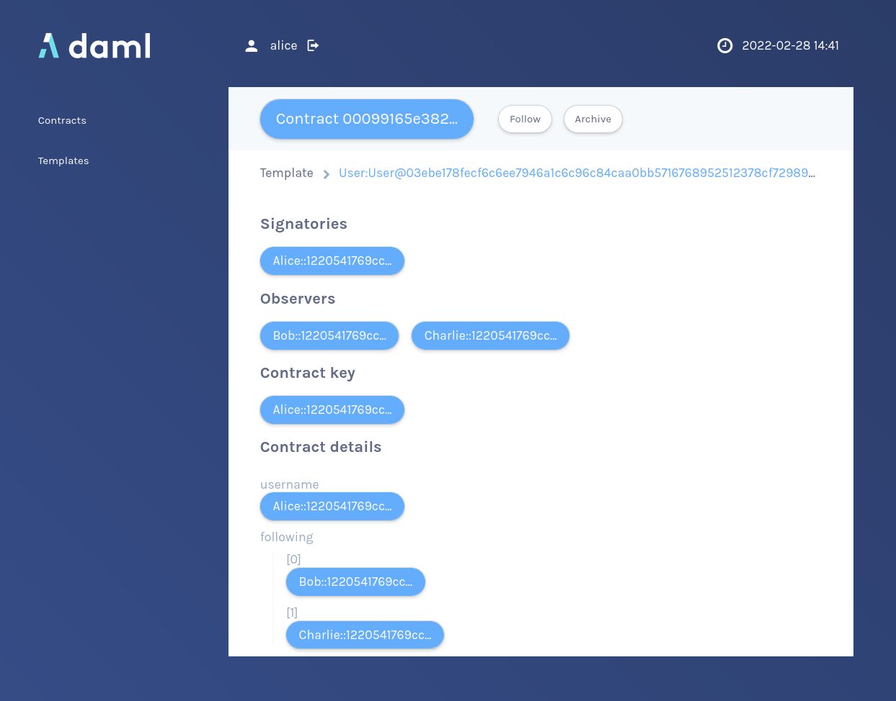

Start the navigator with

```
daml navigator server
```{{execute T2}}

and [open the UI tab](https://[[HOST_SUBDOMAIN]]-4000-[[KATACODA_HOST]].environments.katacoda.com) where the navigator frontend is running. Login as `alice` and inspect the
`contracts` tab, where you find `Alice`s `User` contract.



