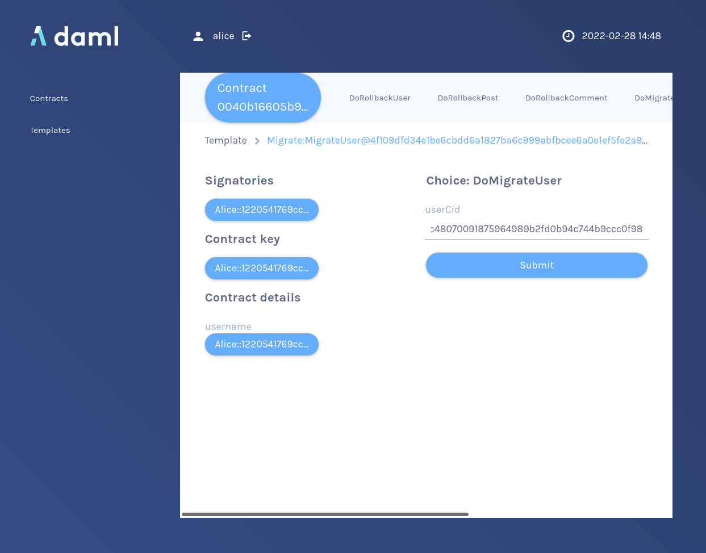

Copy the contract ID of `Alice`s `User` contract by clicking on it
and also note the package ID of the
`create-daml-app-0.1.0` package (it's noted in the `template` field) of the contract.

Now execute the choice `DoMigrateUser` of the newly created migration contract with `Alice`s `User` contract
as argument.

