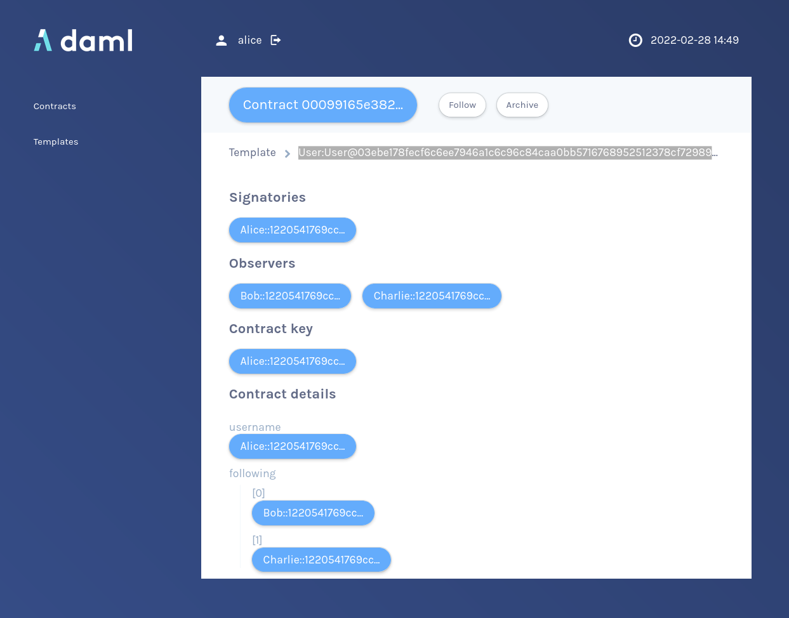

If you inspect `Alice`s `User` contract again, you'll notice that the package ID of it's `User`
template has changed:

The new package ID is from `create-daml-app-0.1.0`, and hence you succesfully upgraded `Alice`'s
contract!

I encourage you to play around in the navigator for a bit and try to upgrade other parties `User`
contracts and also the `Post`s and `Comment`s to get a feel of how the migration is working.

Migrating all contracts by hand would be very tedious. In the third tutorial a much better solution
is presented: we'll extend the user interface of the `create-daml-app` package. In the new UI all
users of the `create-daml-app-0.1.0` package are presented with a pop-up with an option to upgrade.
Moreover, we create a Daml Trigger that moves all the posts and comments automatically.
