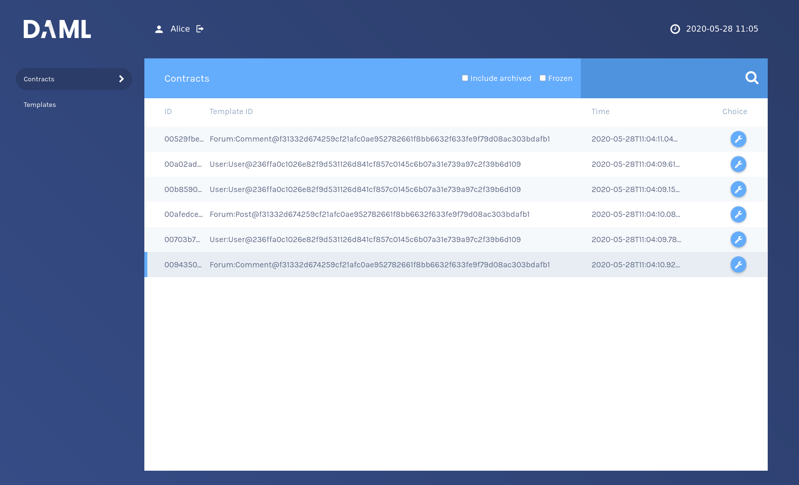

Start the navigator with

```
daml navigator server
```{{execute T2}}

and open the UI tab where the navigator frontend is running. Login as `Alice` and inspect the
`contracts` tab, where you find `Alice`s `User` contract.




