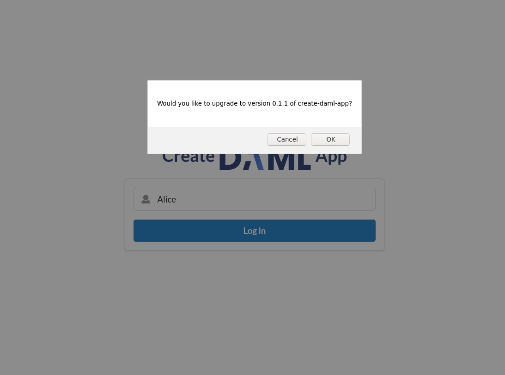
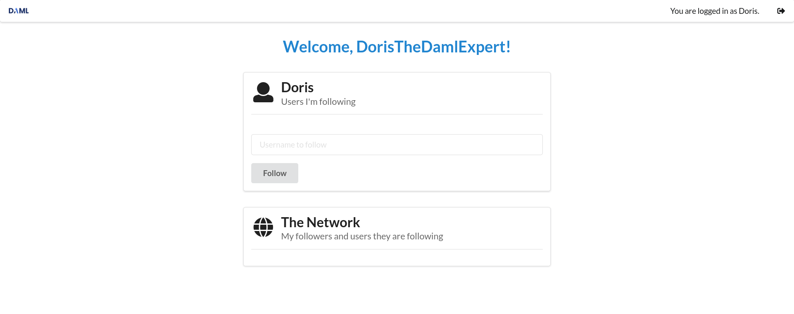

The new UI is ready for a demonstration. Start the UI in the second terminal with

```
npm start
```{{execute T2}}

and [open the UI tab](https://[[HOST_SUBDOMAIN]]-3000-[[KATACODA_HOST]].environments.katacoda.com).
Now try to login as `alice`. `Alice` is already a user of the `create-daml-app-0.1.0` social
network. Hence, you should now see a pop-up asking her to upgrade.



Click on `OK`, and try to login again. All of `Alice`s contracts of the create-daml-app and the
forum have been upgraded!

Now log-out and login as `Doris`. `Doris` signed up to `create-daml-app-0.1.1` and already added a
nickname to her `User` contract. You'll notice the changed `Welcome` line:


