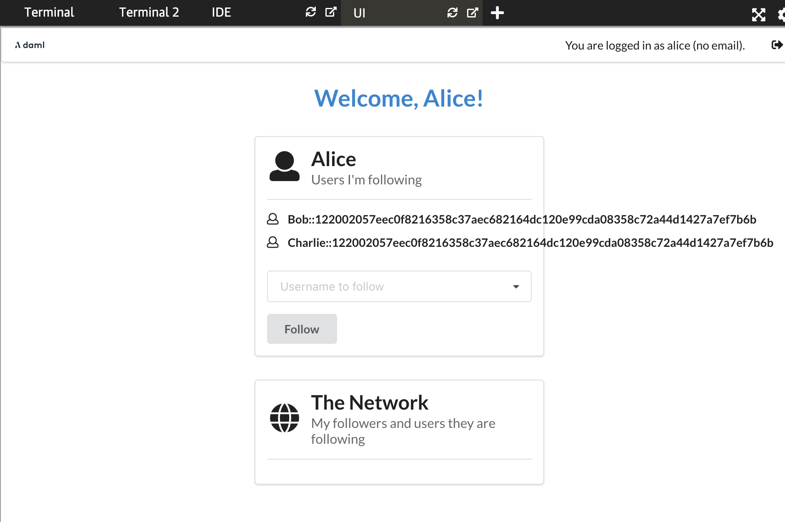
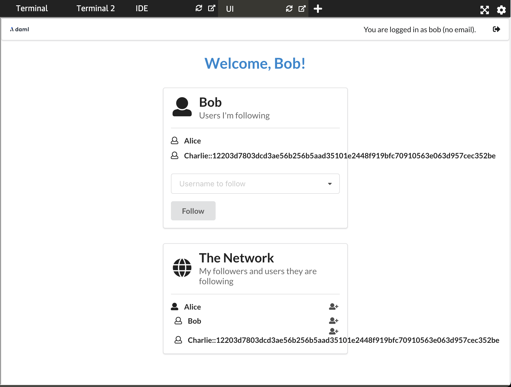
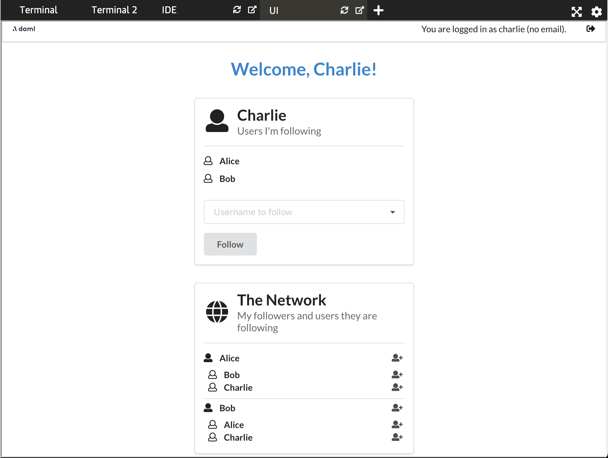

The new UI is ready for a demonstration. Start the UI in the second terminal with

```
npm start
```{{execute T2}}

and [open the UI tab](https://[[HOST_SUBDOMAIN]]-3000-[[KATACODA_HOST]].environments.katacoda.com).
As in previous cases we have three network participants:
1. `Alice` with the username `alice`
2. `Bob` with the username `bob`
3. `Charlie` with the username `charlie`

Now try to login as `alice`. `Alice` is already a user of the `create-daml-app-0.1.0` social
network. Hence, you should now see a pop-up asking her to upgrade.


Click on `OK`. You will receive another popup confirming that her upgrade was successful. As `Bob` and `Charlie` still haven't migrated their contracts you can see the difference in their usernames.



Once `Bob` and `Charlie` upgrade their contracts their usernames will change.



